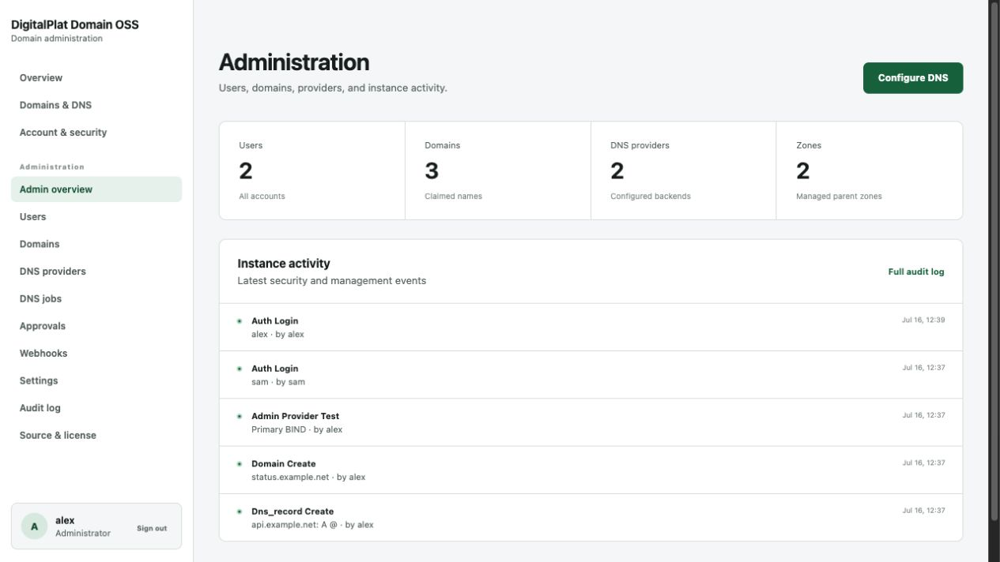
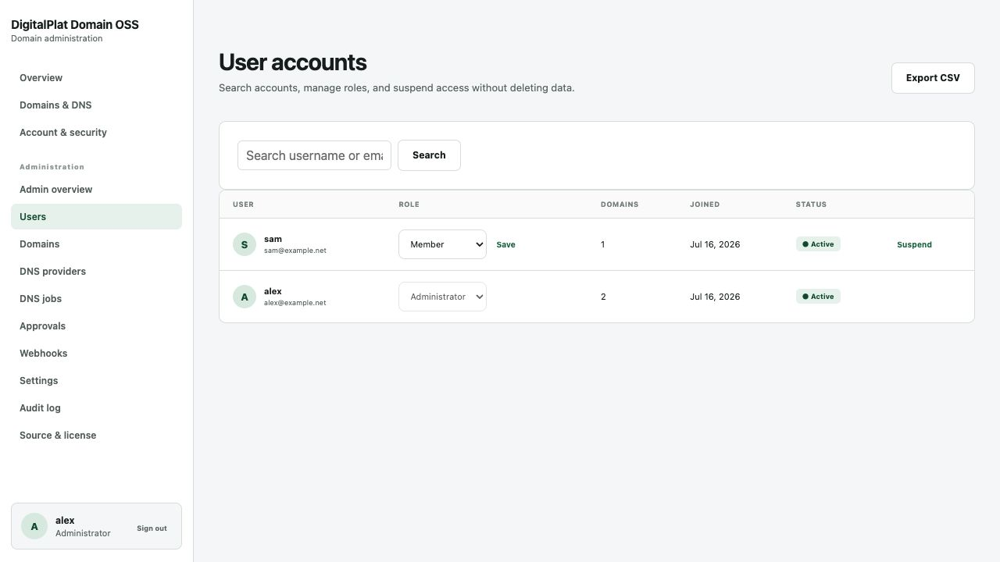
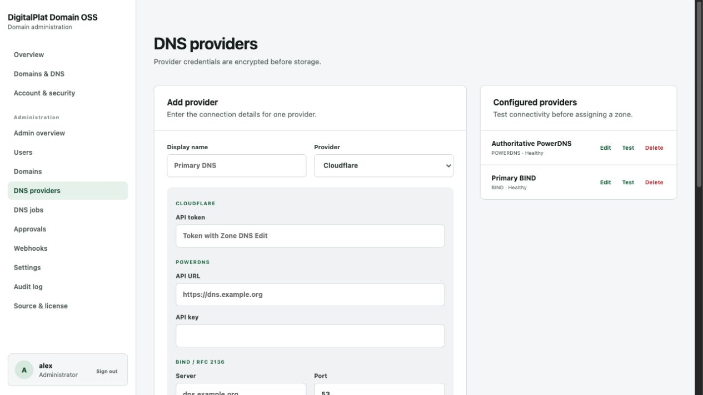

# Administrator guide

## Overview

The administration overview reports account, domain, provider, and zone counts with recent instance activity. All administration actions require an active administrator session and CSRF validation.

## Users

Search users by username or email. Promote a user to administrator, return an administrator to member status, or suspend a member account. The current administrator cannot remove their own administrator access or suspend themselves. Export the complete account list as CSV when needed for an offline review.

## Domains and approvals

Search all domains by FQDN or owner. Change a domain between active and suspended states. Zones in approval mode place new registrations in the approvals queue. The domain export includes status, owner, zone, record count, and creation time.

## DNS providers and zones

Provider credentials are encrypted before database storage. Add one provider configuration per credential boundary and test it before assigning zones. Deleting a provider is blocked while zones still reference it.

A managed zone connects a parent DNS zone to one provider. For Cloudflare, set the remote zone ID. BIND and PowerDNS use the zone name unless a different remote identifier is required.

## Zone policy

Each zone supports:

- Open, approval, or closed registration.
- A per-user quota override.
- Minimum and maximum label length.
- Reserved labels.
- Allowed record types.
- Wildcard record policy.
- DNSSEC status and Cloudflare DNSSEC control.
- Secondary DNS server addresses and health checks. A non-standard port may be written as `host:port` or `[IPv6]:port`.

Use a test zone before enabling a new provider or policy for users.

## DNS jobs

Every record synchronization creates a job with action, status, attempt count, maximum attempts, and last error. Failed and pending jobs can be retried from the administration page. Run a background worker continuously in production.

## Webhooks

Create an HTTPS endpoint, select events, and save the generated signing secret. The secret is shown once. Test delivery before enabling dependent automation. Endpoints can be disabled without deletion.

Private, loopback, link-local, and other non-public targets are rejected by default. Redirects are not followed. See [Automation](AUTOMATION.md) for signature verification.

## Audit log

The audit log records recent authentication, account, domain, DNS, provider, and administration actions with actor, target, time, and source address where available. Export or forward logs regularly if long-term retention is required; the built-in page is an operational view, not an immutable compliance archive.
