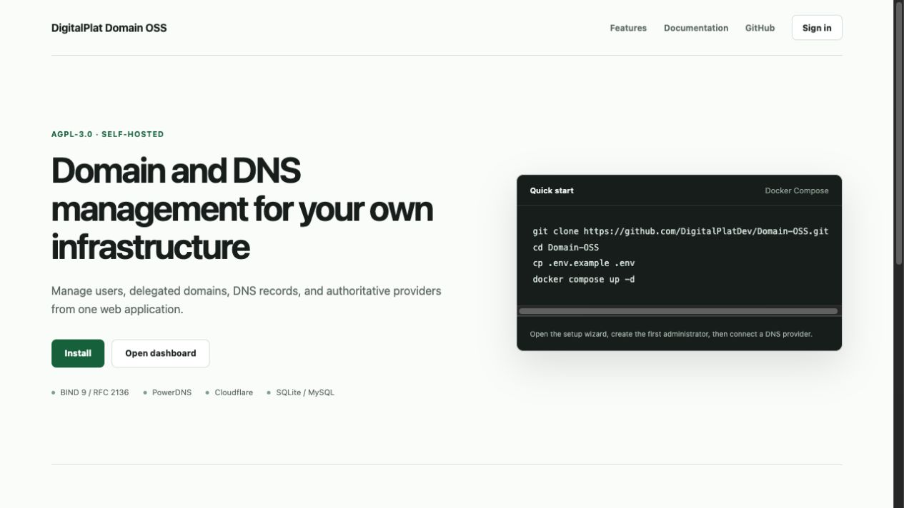
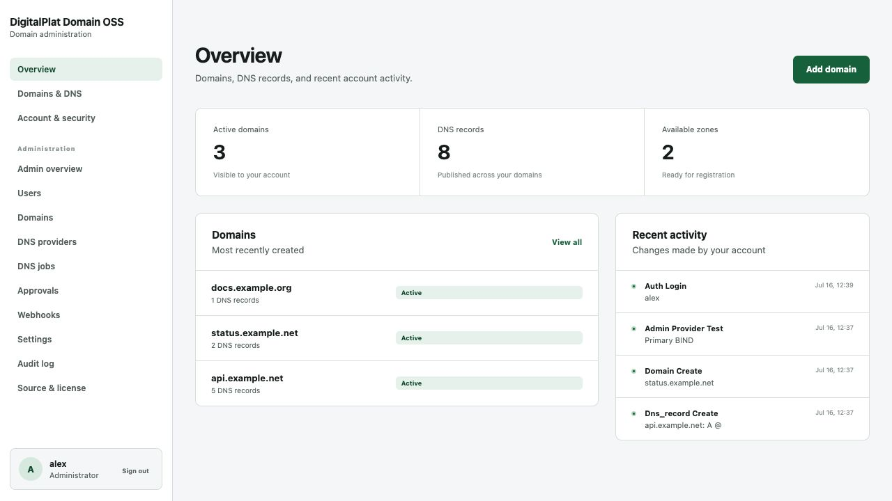

# Interface screenshots

These screenshots were captured from isolated local installations during the browser acceptance test. They exclude browser chrome and use only documentation-specific example domains, users, addresses, and credentials.

## Public home page

## Setup wizard

## User and administrator overview

## Domain registration

## DNS records

## DNS providers

## Administration overview

## User administration

## Account security

The [testing guide](TESTING.md) documents the backing services and test procedure used for these screens.
