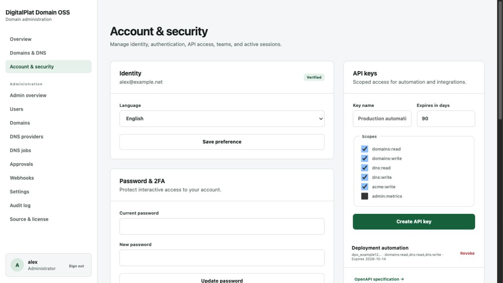
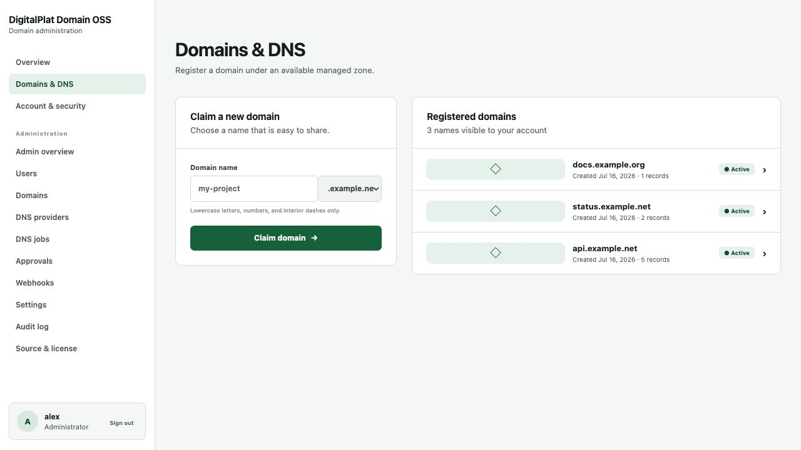
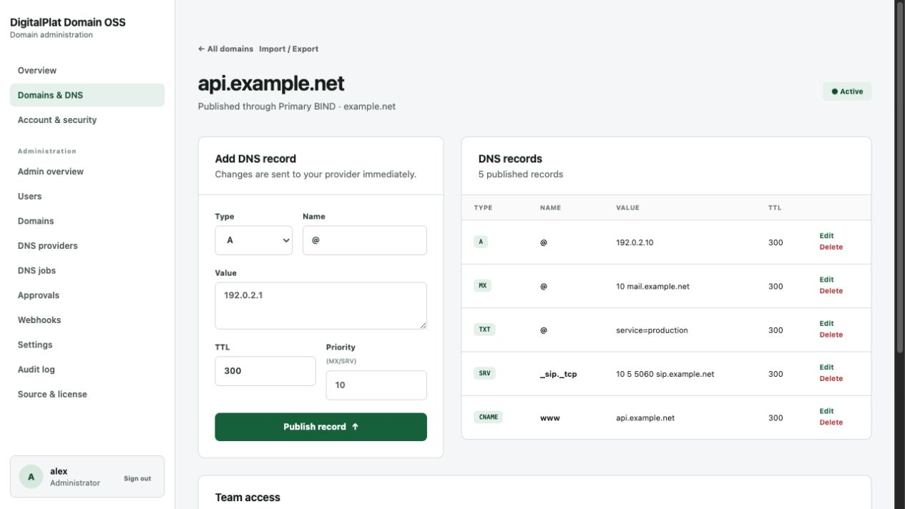

# User guide

## Account access

Use the registration page when public registration is enabled. Usernames are lowercase and passwords require at least 12 characters with a letter and number. Administrators can suspend an account without deleting its domains.

The account page provides password changes, email verification, password recovery, language selection, two-factor authentication, active sessions, API keys, teams, and notifications.

## Two-factor authentication

Open **Account & security**, choose **Enable 2FA**, scan the QR code with a TOTP authenticator, and enter the current six-digit code. Save the manual setup key in a secure recovery location. After activation, a TOTP code is required after a valid password.

Disabling TOTP requires the account password. An administrator cannot retrieve a user's TOTP secret.

## Sessions and API keys

Every interactive login creates a session entry with creation time, last activity, IP address, and user agent. Revoke sessions that are no longer recognized.

API keys are shown once. Select only the scopes needed by the client and set an expiry when possible. Revocation takes effect on the next request.

## Teams

A team owner creates the team, adds an existing user by email, and assigns a role:

- `read_only` can read assigned domains and records.
- `member` can read domains and create, edit, or remove records.
- `operator` can manage assigned domain access in addition to record changes.
- `owner` controls team membership and can assign the team to domains.

A domain owner assigns or removes a team from the domain detail page. Personal ownership remains unchanged.

## Domains

The domains page lists managed parent zones available to the account. Enter one DNS label and choose a zone. Registration can be open, require administrator approval, or be closed. Zone policy also controls reserved names, label length, wildcards, record types, and per-user quota.

Pending domains cannot publish records until approved. Suspended domains remain visible but DNS changes are disabled.

## DNS records

Supported record types are A, AAAA, CNAME, MX, TXT, SRV, CAA, and NS. The form validates record content, TTL, priority, CNAME conflicts, the selected zone policy, and the delegated domain boundary.

Provider updates are attempted immediately and also recorded as durable jobs. If delivery fails, the record remains in the panel and the job worker retries it. The administrator can inspect and retry jobs manually.

Use **Import and export** to download portable JSON or import up to 500 validated records. Invalid items are skipped. Review the resulting DNS jobs after a large import.

## Notifications

Account and infrastructure events appear on the account page. Marking notifications as read does not remove the related audit event or DNS job.
